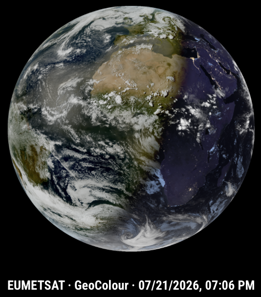

# MMM-Meteosat

MMM-Meteosat displays near-real-time Meteosat Third Generation (MTG) full-disk satellite imagery in [MagicMirror²](https://magicmirror.builders/). Images are obtained directly from the official EUMETSAT EUMETView WMS service, processed locally and cached for reliable display.



## Features

- Official EUMETSAT MTG imagery
- Eight selectable satellite products
- GeoColour day/night imagery as the default
- Transparent full-disk presentation for dark mirror layouts
- Separate cache for every module instance and product
- Local fallback when EUMETSAT or the network is temporarily unavailable
- Configurable display size, source resolution, caption and logging
- Bounded retries for temporary network and server errors
- Suspend/resume support with an immediate update check after resume
- Freshness detection based on satellite acquisition time and unchanged image content
- Defensive limits for downloads, decoded images and concurrent module instances

## Requirements

- MagicMirror²
- Node.js **20.9.0 or newer**
- Internet access from the MagicMirror host to EUMETView

The project CI tests Node.js 22 and 24. The module is also known to run with Node.js 24 and npm 11 in a Docker-based MagicMirror installation.

## Installation

### Standard MagicMirror installation

```bash
cd ~/MagicMirror/modules
git clone https://github.com/FHFH2025/MMM-Meteosat.git
cd MMM-Meteosat
npm install
```

Add the module to `config/config.js`, then restart MagicMirror².

### Docker installation

The module directory must be mounted into the container's MagicMirror `modules` directory. Install dependencies inside the running container so that native packages such as `sharp` are built or selected for the container environment:

```bash
docker exec -it <container-name> bash
cd /opt/magic_mirror/modules/MMM-Meteosat
npm install
exit
```

Adapt the container name and path to your installation.

## Quick start

```js
{
  module: "MMM-Meteosat",
  position: "top_right",
  config: {
    product: "geocolour"
  }
}
```

`geocolour` is the default product. It provides a natural-looking daytime image and incorporates infrared information at night, so clouds remain visible around the clock.

## Complete configuration example

```js
{
  module: "MMM-Meteosat",
  position: "top_right",
  config: {
    product: "geocolour",
    cacheId: "",
    imageSize: 550,
    wmsImageSize: 1800,
    updateInterval: 10 * 60 * 1000,
    showTimestamp: true,
    timestampType: "acquisition",
    timestampLocale: "de-DE",
    timestampOptions: {
      timeZone: "Europe/Berlin",
      day: "2-digit",
      month: "2-digit",
      year: "numeric",
      hour: "2-digit",
      minute: "2-digit",
      hour12: false
    },
    showSource: true,
    showProduct: true,
    showStatus: true,
    logLevel: "INFO",
    staleAfter: 90 * 60 * 1000,
    retryDelays: [15 * 1000, 45 * 1000],
    messages: {
      loading: "Loading Meteosat image …",
      noImage: "No Meteosat image is available yet.",
      error: "Meteosat image could not be loaded.",
      stale: "delayed"
    }
  }
}
```

## Configuration reference

The table below is validated automatically against the public defaults in `MMM-Meteosat.js`. A CI check fails when a public option is added or removed without updating this table, or when a documented default no longer matches the code.

<!-- config-reference:start -->
| Option | Type | Default | Description |
|---|---|---|---|
| `product` | string | `"geocolour"` | Satellite product. See [Products](#products). Unsupported values are rejected. |
| `cacheId` | string | `""` | Optional stable cache-folder identifier. Normally left empty. It is lowercased and unsafe characters are replaced with `-`. |
| `imageSize` | number | `550` | Display width in pixels. Values below 1 are raised to 1 by the node helper. |
| `wmsImageSize` | number | `1800` | Width and height of the downloaded WMS image. Accepted range: 600–3600 pixels. |
| `updateInterval` | number | `600000` | Update interval in milliseconds. Values below five minutes are raised to five minutes. |
| `showTimestamp` | boolean | `true` | Shows the selected timestamp in the caption. |
| `timestampType` | string | `"acquisition"` | `"acquisition"` shows the satellite image time reported by EUMETSAT and is recommended. `"download"` shows the local successful-download time and is mainly useful for diagnostics. If acquisition time is unavailable, download time is used as a fallback. |
| `timestampLocale` | string or undefined | `undefined` | Locale passed to `Intl.DateTimeFormat`, for example `"de-DE"` or `"en-GB"`. `undefined` uses the browser locale. |
| `timestampOptions.day` | string | `"2-digit"` | Day formatting passed to `Intl.DateTimeFormat`. |
| `timestampOptions.month` | string | `"2-digit"` | Month formatting passed to `Intl.DateTimeFormat`. |
| `timestampOptions.year` | string | `"numeric"` | Year formatting passed to `Intl.DateTimeFormat`. |
| `timestampOptions.hour` | string | `"2-digit"` | Hour formatting passed to `Intl.DateTimeFormat`. |
| `timestampOptions.minute` | string | `"2-digit"` | Minute formatting passed to `Intl.DateTimeFormat`. Additional valid `Intl.DateTimeFormat` options, such as `timeZone`, `timeZoneName` and `hour12`, may be supplied. |
| `showSource` | boolean | `true` | Shows `EUMETSAT` in the caption. |
| `showProduct` | boolean | `true` | Shows the resolved product label in the caption. |
| `showStatus` | boolean | `true` | Shows loading, no-image and error messages when no image can be displayed. It does **not** hide the stale label in the caption. |
| `logLevel` | string | `"INFO"` | Log level: `ERROR`, `WARN`, `INFO` or `DEBUG`. Invalid values fall back to `INFO`. |
| `staleAfter` | number | `5400000` | Freshness threshold in milliseconds. An image is marked delayed when its acquisition time or the time since the last actual content change exceeds this value. Set to `0` to disable stale detection. |
| `retryDelays` | number[] | `[15000,45000]` | Delays before retrying temporary network, timeout, HTTP 429 or HTTP 5xx failures. At most five entries are used and each delay is capped at five minutes. Use `[]` to disable retries. |
| `messages.loading` | string | `"Loading Meteosat image …"` | Message shown while the first image is being requested. |
| `messages.noImage` | string | `"No Meteosat image is available yet."` | Message shown when no cached or newly downloaded image exists. |
| `messages.error` | string | `"Meteosat image could not be loaded."` | Message shown after a download, validation or image-processing failure. Technical details remain in the MagicMirror log. |
| `messages.stale` | string | `"delayed"` | Caption label appended when the displayed image is stale. Set to `""` to suppress only the visible label while retaining detection and logging. |
<!-- config-reference:end -->

### Status-message visibility

`showStatus: false` hides only the loading, no-image and error text displayed instead of an image. It does not alter the caption. To keep stale detection but hide its visible caption label, set:

```js
messages: {
  stale: ""
}
```

## Products

| Value | EUMETSAT label | What it shows | Typical use |
|---|---|---|---|
| `geocolour` | GeoColour | Natural colours by day with infrared enhancement at night. | Recommended general-purpose view. |
| `dust` | Dust RGB | Highlights airborne dust, including large Saharan dust plumes. | Tracking dust over Africa, the Atlantic and Europe. |
| `cloudphase` | Cloud Phase RGB | Distinguishes cloud properties such as ice, water and thinner cloud. | Analysing cloud structure. |
| `cloudtype` | Cloud Type RGB | Classifies cloud types instead of presenting a natural-colour photograph. | Comparing high, low, thick and thin cloud areas. |
| `fog` | Fog / Low Clouds RGB | Emphasises fog and low cloud, particularly at night and around sunrise. | Fog and low-cloud monitoring. |
| `firetemperature` | Fire Temperature RGB | Highlights exceptionally hot areas that may be associated with active fires. | Observing large wildfires and strong heat sources. |
| `snow` | Snow RGB | Helps distinguish snow-covered land from clouds during daylight. | Monitoring snow cover. |
| `infrared` | Infrared 10.5 µm | Pure infrared imagery in which cold, high cloud tops stand out. | Continuous day/night cloud monitoring. |

### Incomplete-looking specialised products

Some specialised products may show only part of the Earth disc, contain blank areas or appear less complete than GeoColour. This is normally a property of the EUMETSAT source product, not cropping by MMM-Meteosat. The module preserves the source data and applies only the geometric full-disk transparency mask.

## Caption and timestamps

Depending on the visibility options, the caption is assembled in this order:

```text
EUMETSAT · Product · Satellite image time · delayed
```

Only enabled and available fields are included.

The default timestamp is the **satellite acquisition time** reported by EUMETSAT. This describes when the displayed observation was made and is therefore more meaningful than the time at which the file reached the MagicMirror host. Download time remains available through `timestampType: "download"` and is also retained internally for diagnostics.

## Update process

```text
Scheduled update or resume
          │
          ▼
Fetch EUMETSAT GetCapabilities
          │
          ▼
Determine latest acquisition time
          │
          ├── Same as cached image ──► update status only
          │
          ▼
Download WMS image
          │
          ▼
Validate size, content type and image
          │
          ├── Same SHA-256 hash ─────► preserve processed image
          │
          ▼
Apply full-disk transparency mask
          │
          ▼
Atomically update cache and browser image
```

The default interval is ten minutes. The hard minimum is five minutes because the upstream product cadence and service load do not justify more frequent polling.

## Freshness detection

Freshness is evaluated from two independent signals:

1. **Acquisition age** — the time elapsed since the satellite image was acquired.
2. **Unchanged-content age** — the time elapsed since the downloaded image content last changed, based on its SHA-256 hash.

When either age exceeds `staleAfter`, the image is marked stale, the configured `messages.stale` label is appended to the caption and a warning is written to the log. Existing imagery remains visible; the module does not replace it with a decorative fallback image.

`staleAfter: 0` disables both freshness checks.

## Suspend and resume

MMM-Meteosat implements the standard MagicMirror module lifecycle.

While suspended, the node helper:

- stops the scheduled update timer;
- aborts an active network request;
- cancels a pending retry wait;
- performs no new image processing.

On resume, the update timer is restored and an immediate freshness/update check is requested. If an older operation is still finishing, the helper queues one resume update instead of starting duplicate work.

## Cache layout

Each module instance receives its own cache folder. MagicMirror identifiers such as `module_3_MMM-Meteosat` are shortened automatically:

```text
cache/m3/geocolour/
cache/m4/infrared/
```

A stable custom identifier can be selected:

```js
config: {
  product: "geocolour",
  cacheId: "Living Room"
}
```

This produces:

```text
cache/living-room/geocolour/
```

Each product directory contains:

```text
source.png   Original validated WMS image
latest.png   Processed image displayed by MagicMirror²
status.json  Metadata and operational state
```

`status.json` may contain:

- requested and resolved product;
- product label and WMS layer;
- source URL/service information;
- satellite acquisition time;
- WMS response time;
- legacy/local download time;
- last update attempt;
- last successful image download;
- last actual image-content change;
- SHA-256 content hash;
- image-processing metadata.

If a new source image has the same hash as the cached source, `latest.png` is retained and the time of the last actual content change is preserved. If an update fails, an existing `latest.png` remains available as the local fallback.

## Image processing and safety limits

The node helper downloads the original EUMETView image and creates a transparent PNG by applying a geometric full-disk mask. Processing is performed with `sharp`.

Runtime limits include:

- WMS image download: 40 MiB maximum;
- capabilities document: 5 MiB maximum;
- decoded input image: 3600 × 3600 pixels maximum;
- WMS request size: 600–3600 pixels;
- module instances per node-helper process: 10 maximum;
- retry delays: five entries maximum, each capped at five minutes.

Temporary files use unique names and are removed after failures. Cache state is validated before it is trusted.

## Logging

Available levels:

| Level | Use |
|---|---|
| `ERROR` | Failed updates and configuration errors only. |
| `WARN` | Errors plus stale-image and recoverable warning conditions. |
| `INFO` | Normal startup and successful image updates. Recommended default. |
| `DEBUG` | Detailed configuration, cache, HTTP and update-decision diagnostics. |

Use `DEBUG` temporarily for troubleshooting; it produces substantially more log output.

## Troubleshooting

### No image appears

1. Confirm that the MagicMirror host or container can access the Internet.
2. Confirm that `product` is one of the documented product values.
3. Inspect the MagicMirror log for `MMM-Meteosat` entries.
4. Keep `wmsImageSize: 1800` while testing.
5. Run the local verification commands from [Development and tests](#development-and-tests).

### The image is marked delayed

Compare the displayed acquisition time with the current time. EUMETSAT may temporarily publish late or unchanged imagery. With `logLevel: "DEBUG"`, the helper logs acquisition time, cached time and update decisions. Increase `staleAfter` only when a longer delay is acceptable for your use case.

### A specialised product looks incomplete

Compare it with `geocolour`. Blank or partial areas are often expected for specialised RGB products and do not necessarily indicate a module error.

### Sharp/Electron warning on Linux

Electron may print a warning that its Linux binaries could be incompatible with `sharp`. A warning alone does not mean processing failed. Verify that `npm test` passes and that the module successfully creates or updates `cache/.../latest.png`. Install dependencies inside the same container/runtime that executes MagicMirror.

### Clear one cached product

Stop MagicMirror² and remove only the affected product directory:

```bash
cd ~/MagicMirror/modules/MMM-Meteosat
rm -rf cache/m3/geocolour
```

The directory is recreated during the next update.

## Updating

```bash
cd ~/MagicMirror/modules/MMM-Meteosat
git pull
npm install
```

Restart MagicMirror² afterwards. For Docker installations, run `npm install` inside the MagicMirror container.

## Upgrade notes for 1.3.0

Version 1.3.0 adds suspend/resume handling and richer freshness state. Existing 1.2.x cache directories remain usable. New fields such as `lastAttemptAt`, `lastSuccessfulDownloadAt` and `lastImageChangeAt` can initially be absent in an older `status.json`; they are populated as relevant update events occur.

No new satellite source or custom image-source abstraction was introduced. MMM-Meteosat remains intentionally focused on official Meteosat satellite imagery.

## Project structure

```text
MMM-Meteosat.js       Browser-side MagicMirror module and public defaults
node_helper.js        Scheduling, downloads, cache state and lifecycle handling
src/config.js         Normalisation and hard configuration limits
src/products.js       Supported EUMETSAT product profiles
src/sources/wms.js    EUMETView WMS capabilities and image requests
src/imageProcessor.js Image validation and full-disk transparency processing
src/cache.js          Cache paths, validation and atomic state handling
src/status.js         Freshness evaluation
src/retry.js          Abort-aware bounded retry handling
src/logger.js         Structured module logging
test/                 Automated tests and deterministic fixtures
scripts/              Repository maintenance and documentation checks
```

## Development and tests

Install exactly the dependencies recorded in `package-lock.json` and run the full verification:

```bash
npm ci
npm run check
npm test
npm run docs:check
npm audit --omit=dev --audit-level=high
```

GitHub Actions performs these checks on Node.js 22 and 24 for every push and pull request.

### README configuration validation

`scripts/validate-readme.js` loads the public defaults directly from `MMM-Meteosat.js`, flattens nested options such as `timestampOptions.*` and `messages.*`, and compares them with the marked configuration-reference table in this README.

When adding, removing or changing a public configuration option:

1. change the code default;
2. update the configuration table and explanatory text;
3. run `npm run docs:check`;
4. commit both changes together.

This keeps the README tied to the implementation instead of relying on manual release-time memory.

## Contributing, security and releases

- Contribution guidance: [CONTRIBUTING.md](CONTRIBUTING.md)
- Security policy: [SECURITY.md](SECURITY.md)
- Release history: [CHANGELOG.md](CHANGELOG.md)
- Community standards: [CODE_OF_CONDUCT.md](CODE_OF_CONDUCT.md)

## Data source and licence

Satellite imagery is provided by EUMETSAT. This module is not affiliated with or endorsed by EUMETSAT.

The module source code is released under the MIT License. Satellite imagery remains subject to the applicable EUMETSAT data policy and attribution requirements.
